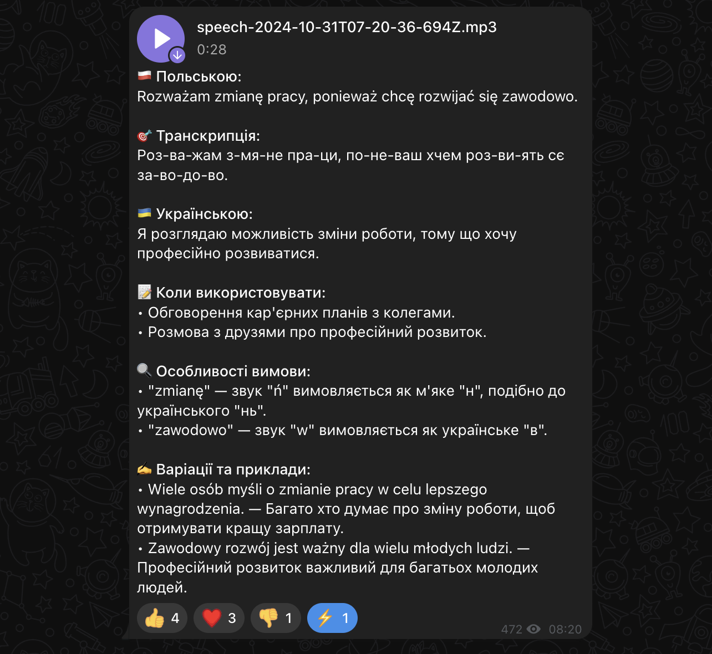
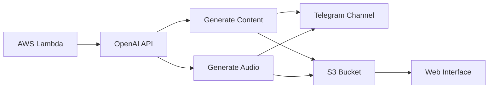

# Phrase Bridge

An app that helps you learn languages by creating daily phrases using OpenAI. It consists of two parts:
- A Lambda function that generates and posts language learning content to Telegram channels and S3
- A web interface that displays the latest phrases with audio support

## Features

### Lambda Function
- 🤖 Uses OpenAI to generate language learning content
- 🎯 Creates daily phrases with transcription and pronunciation tips
- 🎙️ Generates audio using OpenAI's text-to-speech
- 📱 Posts to Telegram channels automatically
- 🪣 Stores content in S3 for the web interface

### Web Interface
- 🌐 Simple and clean design
- 🌙 Dark mode support
- 🔊 Audio playback support
- 🔄 Multiple language bridges
- 📱 Mobile-friendly

## Architecture

## Language Bridges

Currently supported language pairs:
- [x] 🇺🇦 UA → 🇵🇱 PL (Ukrainian to Polish)
- [ ] 🇺🇦 UA → 🇬🇧 EN (Ukrainian to English)
- [ ] 🇬🇧 EN → 🇪🇸 ES (English to Spanish)

## Roadmap

- [x] Daily messages on Telegram
- [x] Audio support
- [x] Telegram poll
- [x] Web interface
- [ ] S3 auto upload
- [ ] Bridges:
  - [x] UA-PL
  - [ ] UA-EN
  - [ ] EN-ES

## Contributing

Contributions are welcome! Please feel free to submit a Pull Request.

## License

This project is licensed under the MIT License - see the [LICENSE](LICENSE) file for details.

## Acknowledgments

- OpenAI for their powerful API
- Telegram for their Bot API
- AWS for Lambda and S3 services

## Contributors

- [veelenga](https://github.com/veelenga) Vitalii Elenhaupt - creator, maintainer
